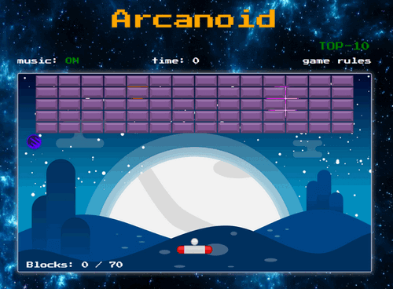

# [Arcanoid-game](https://igor-bochenkov.github.io/arcanoid-game/)

Игра Arcanoid на `canvas API`

### Цель игры:

Уничтожить мячом все панели за минимальное время.

### Правила игры:

Игрок управляет небольшой платформой, которую он перемещает горизонтально от одной стенки до другой. Платформу нужно подставлять под шарик, чтобы тот не упал вниз, иначе игра закончится пройгрышем. Удар шарика по панели приводит к его уничтожению.

### Управление:

- перемещение платформы: `←` `→` / `A`, `D`
- старт мяча: `SPACE` / `W`

https://igor-bochenkov.github.io/arcanoid-game/
